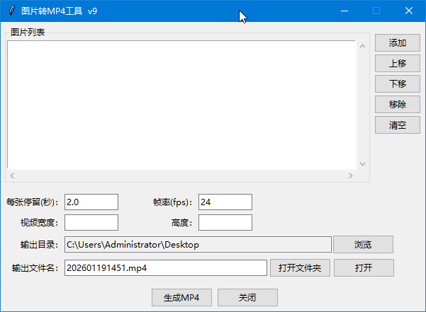

# imgs2mp4

一款支持拖拽的图片串联合并 MP4 小工具，图形界面一键完成。

---

## 功能特点
- 拖拽添加图片（PNG/JPG/JPEG）
- 界面内调整顺序、删除、预览
- 自定义帧率与输出文件名
- 一键生成 H.264 编码 MP4
- 可打包为绿色单文件可执行程序

---

## 快速开始

### 1）下载即用可执行文件
前往 [Releases](https://github.com/xuqb1/img2mp4/releases) → 解压 → 双击 `img2mp4.exe` 即可运行。
提示：由于ffmpeg.exe文件太大了，img2mp4.zip文件上传失败。无法直接下载。可以自行下载ffmpeg.exe，放到img2mp4.exe相同文件夹里。

### 2）源码运行
```bash
# Python ≥ 3.8（推荐 3.12）
git clone https://github.com/xuqb1/imgs2mp4.git
cd imgs2mp4
pip install pyinstaller pillow tkinterdnd2
python img2mp4_gui.py
```

### 3) 自行打包便携 EXE
```bash
pip install pyinstaller pillow tkinterdnd2
pyinstaller -F -w -i app.ico --hidden-import tkinterdnd2 img2mp4_gui.py
# dist/imgs2mp4.exe  generated
```

## 界面截图


## 依赖要求
- pillow
- tkinterdnd2

---

## 开源协议
MIT © 2026 xuqb1
